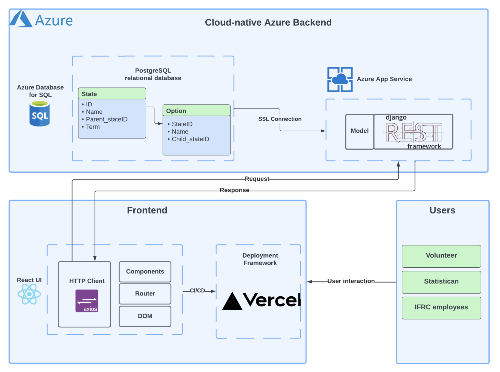
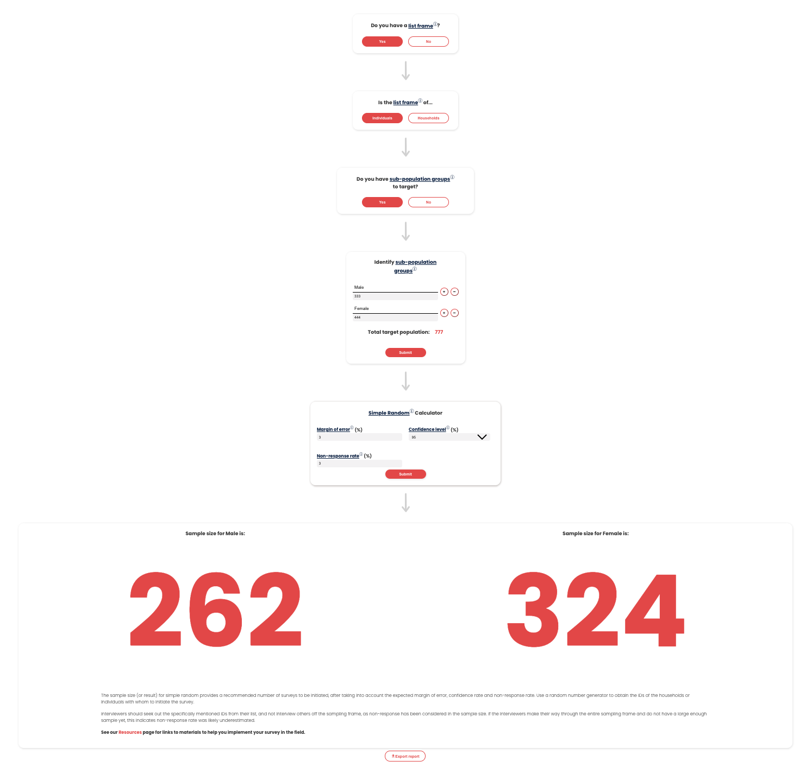
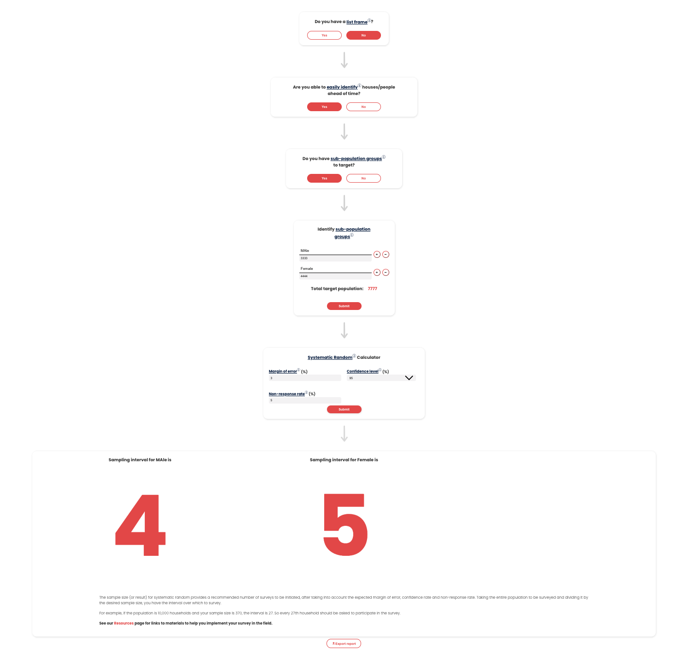
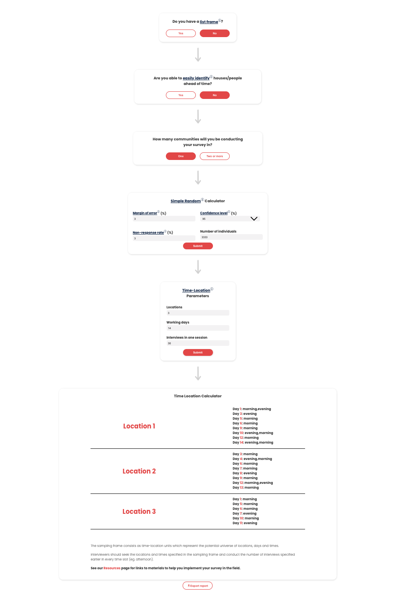
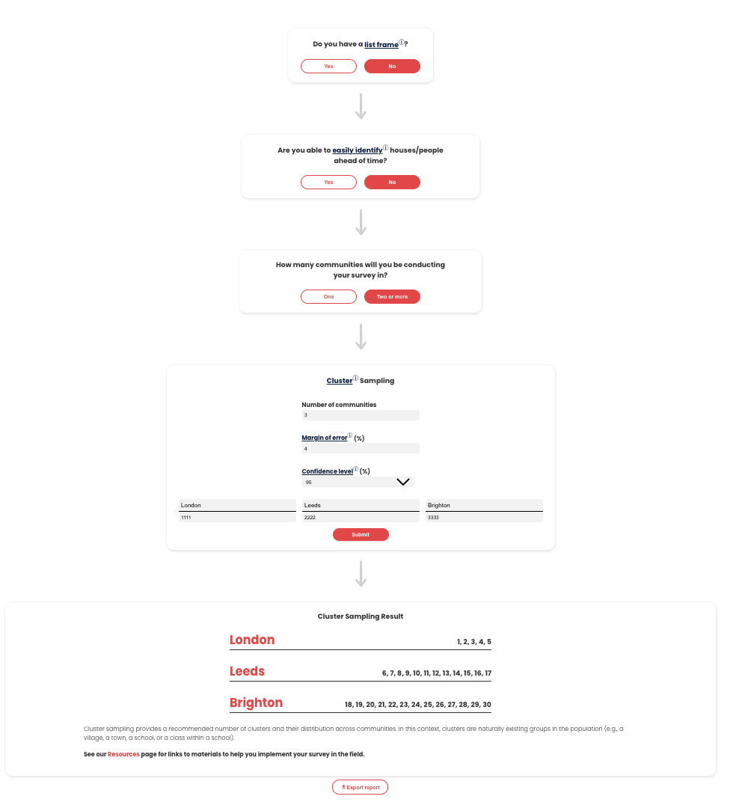
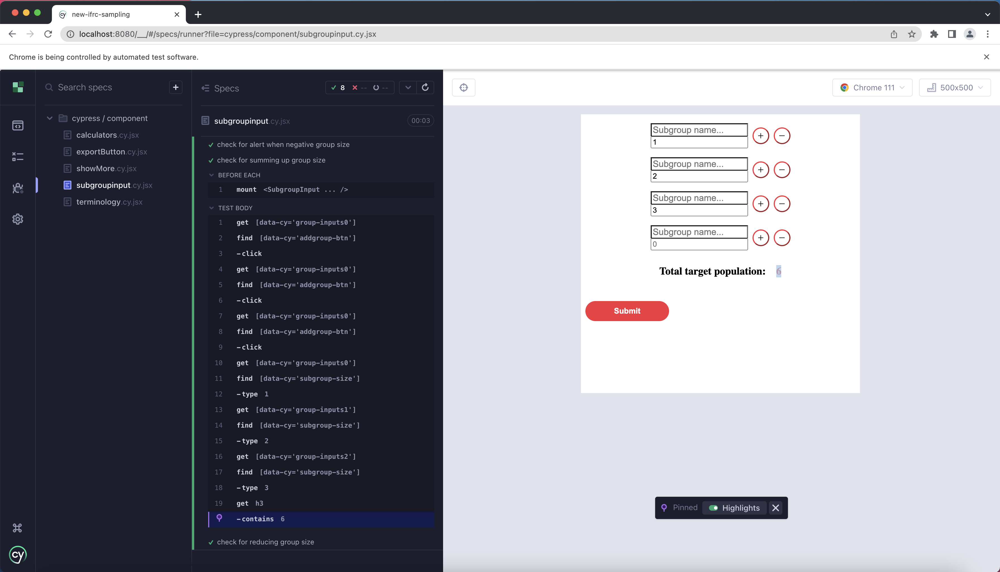
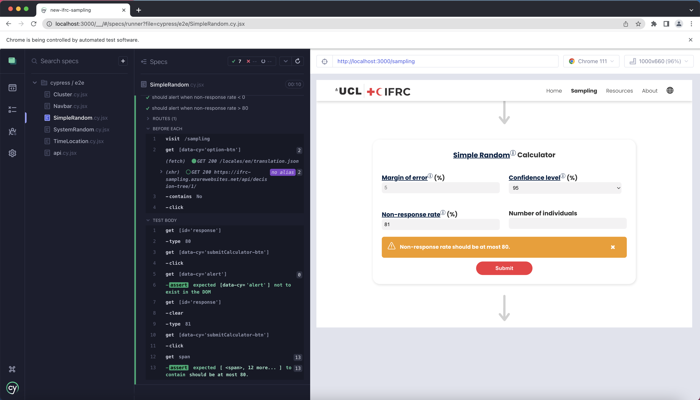

# IFRC Community Sampling Tool

The aim of this tool is to intuitively guide the users through the sampling process. The users answer the questions in a decision tree and finally led to one of the four most popular sampling methods(simple random sampling, systematic random sampling, cluster sampling, time-location sampling) that suits their needs the best. The result can be storable and portable by exported into PDF.\

The tool is designed to be educational and easy to use so that it caters to users of all levels of statistical background.

## System Architecture


## Deployment Manual

### Prerequisites
- [Git](https://git-scm.com/)
- [Node.js](https://nodejs.org/en)

### Installation
```bash
git clone https://github.com/hubamatyas/ifrc-sampling.git
npm install
```

### Run the app
```bash
npm start
```

## Testing

Cypress framework is used for both component and end-to-end testings.\
The base URL for end-to-end testing is configured in file cypress.config.ts\
See the [documentation](https://docs.cypress.io/) for more about testing using Cypress.

### `npx cypress open`

Launches the Cypress test runner in the interactive watch mode.

### `npx cypress run`

Runs the Cypress tests and displays the results in terminal.\
Automatic video recording and screenshots has been turned off. See [here](https://docs.cypress.io/guides/guides/screenshots-and-videos) for more information.

### Create a New Production Build
```bash
npm run build
```

## Showcase

### Tool Interface

- Simple Random Sampling

<br><br>
- Systematic Random Sampling

<br><br>
- Time-Location Sampling

<br><br>
- Cluster Sampling


### Cypress Testing Interface

- Component Testing

<br><br>
- End-to-end Testing


## Bug

### Testing - e2e/cluster.cy.tsx
Whatever is the first test in e2e/cluster.cy.tsx would fail. It can be reproduced by running 'npx cypress run' or 'npx cypress open' -> choose e2e testing -> click cluster.cy.tsx file. \
Under interactive mode by running 'npx cypress open', the test will pass when it is rerun.


